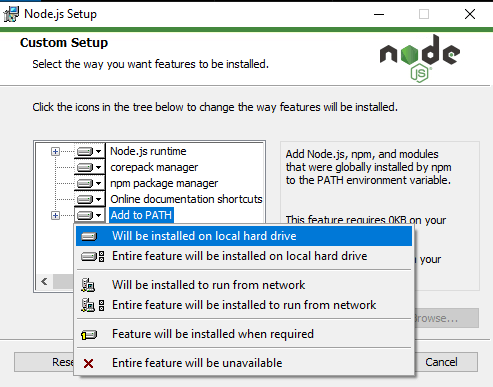
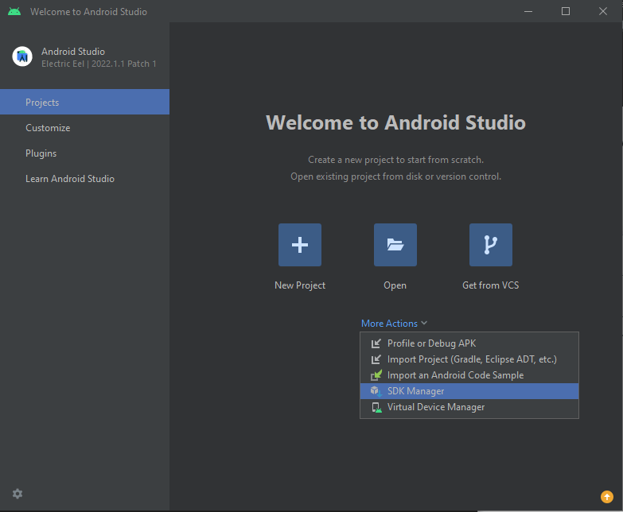
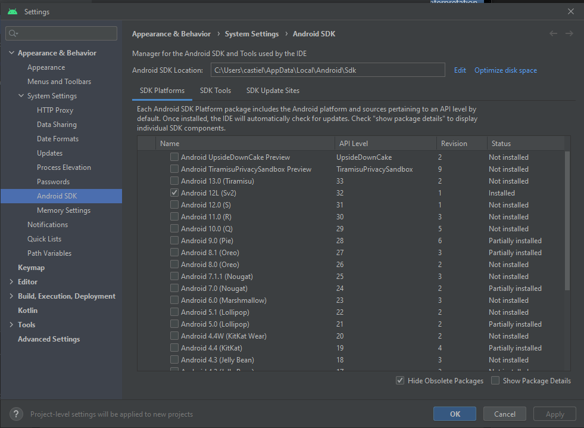
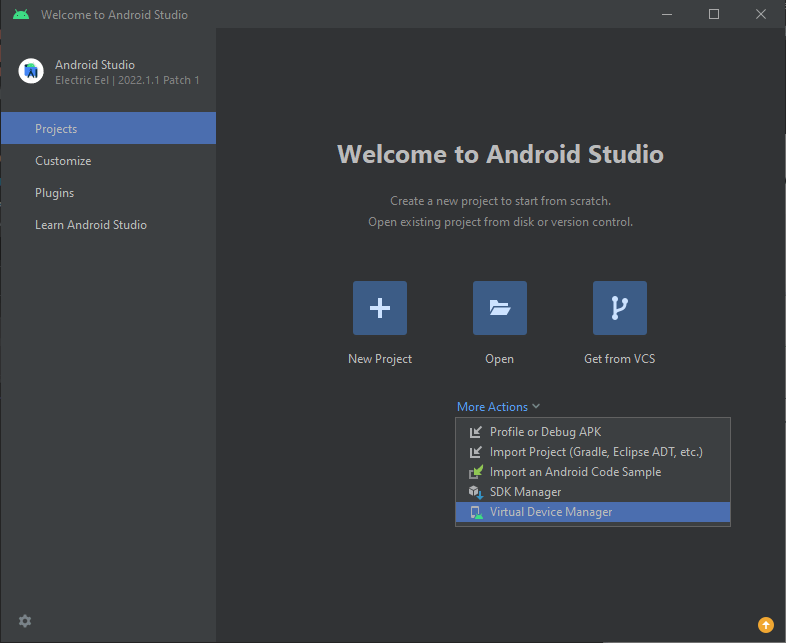
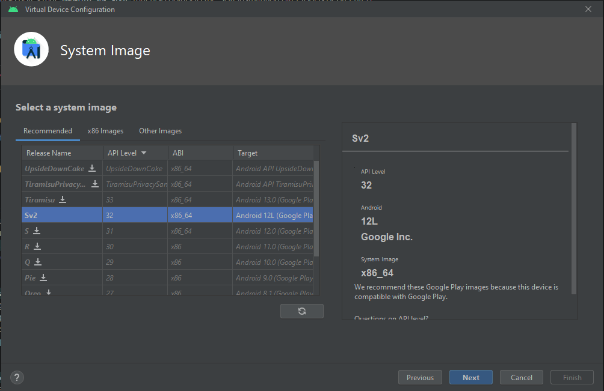

# Windows 10 version 2004 and up or 11 - release and development

A guide on how to set up a workspace and run a Capacitor app on Windows 10 version 2004 and up or Windows 11. All
commands will be ran in a standard Windows command prompt.

## Installing Prerequisites for Capacitor

Install the latest LTS version (**18.15.0**) of Node.JS for your system from the
following [link](https://nodejs.org/en/download/):

```none
https://nodejs.org/en/download/
```

During the installation, make sure to select ``Add to PATH``.



## Setting up a project using a demo template

Create a new Capacitor app with the following command:

```cmd
npm init @capacitor/app
```

Inside the root of the new Capacitor app project folder, run the following commands:

```cmd
npm i @capacitor/core
npm i -D @capacitor/cli
npx cap init
```

## Adding Android support

## Installing requirements for Android

TODO

### Java SDK

Install the latest LTS version (**20**) of Java 20 for your system from the
following [link](https://www.oracle.com/java/technologies/downloads/#jdk20-windows):

```none
https://www.oracle.com/java/technologies/downloads/#jdk20-windows
```

### Android SDK

Install the latest version (**2022.1.1 Patch 2**) of Android Studio Electric Eel for your system from the
following [link](https://developer.android.com/studio):

```none
https://developer.android.com/studio
```

Once Android Studio has been installed, we need to add the necessary SDK and tools to your Android Studio installation.

```none
1. Open Android Studio
2. Click on "More Actions"
3. Click on "SDK Manager"
```



Inside the  ``SDK Platforms`` tab, check ``Android 12L (Sv2)``.



### Android Target

Once Android Studio has been installed, we need create a virtual device.

```none
1. Open Android Studio
2. Click on "More Actions"
3. Click on "Virtual Device Manager"
```



Once the window is open click on ``Create device`` and follow the steps from the wizard. When asked
to ``Select a system image`` make sure to select ``Sv2``.



### Adding the Android platform

Inside the root of the project, run the following commands:

```cmd
npm install @capacitor/android
npx cap add android
```

## Opening an Android application in Android Studio

Inside the root of the project, run the following command:

```cmd
npx cap open android
```

## Running the Android application

Inside the root of the project, run the following command:

```cmd
npx cap run android
```

Choose a device within the list to push the application to. If a physical device with "USB Debugging" turned on is
connected to the computer, it will also appear in the same list.

# Converting a Cordova Application to Capacitor

## Adding Capacitor

Run the following command in the root of your Cordova project to add Capacitor to it:

```cmd
npx cap init
```

## Build your Web App

Run the following command in the root of your Capacitor project to build your web project to ensure that all the folders
and files are configured:

```cmd
npm run build
```

## Adding the Android platform

Inside the root of the project, run the following commands:

```cmd
npm install @capacitor/android
npx cap add android
```

## Syncing the project

Run the following command in the root of your Capacitor project to sync your plugins from the project with the native
code for Android:

```cmd
npx cap sync
```

## Running the Android application

Inside the root of the project, run the following command:

```cmd
npx cap run android
```

Choose a device within the list to push the application to. If a physical device with "USB Debugging" turned on is
connected to the computer, it will also appear in the same list.