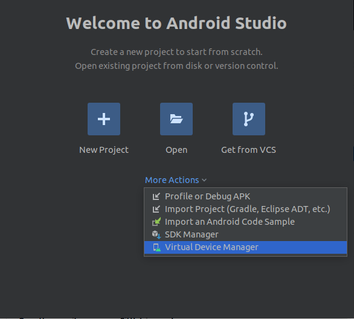

# Ubuntu 20.04 LTS and up - release and development

A guide on how to set up a workspace and run a Cordova app on Android 12L on Ubuntu 20.04 LTS and up. All commands will
be ran in the standard Ubuntu terminal.

## Installing Prerequisites for Cordova

Install the latest version of Node.JS for your system with the following command:

```bash
sudo apt install nodejs
```

Install the latest version of npm for your system with the following command:

```bash
sudo apt install npm
```

Make sure that both prerequisites are installed correctly by running the following commands:

```bash
node -v
npm -v
```

Once both prerequisites are installed correctly, run the following command:

```bash
sudo npm install -g cordova
```

## Setting up a project using a demo template

Once Cordova has been installed correctly using npm, move into your working directory and run the following command to
create a demo project:

```bash
cordova create hello com.example.hello HelloWorld
```

A Cordova demo project should be created. Make sure a proper directory with the name "hello" has been created with all
its related files being created inside.

## Adding Android support

### Adding the Android platform

Travel inside your project's directory and run the following commands to add Android 12L support to your project:

```bash
cd hello
cordova platform add android@11.0.0
```

Once done, you can verify it has been added successfully using the following command:

```bash
cordova platform ls
```

## Installing requirements for Android

Once you have added your Android platform to the Cordova project with no problems. It is time to check if you comply
with all the requirements necessary to build and release an Android app. To see which requirements you are missing, run
the following command:

```bash
cordova requirements
```

If you have a clean system, you will be missing all requirements, this guide will show you how to comply with each
individual prerequisite.

### Java SDK

Install the latest version of Java 11 for Ubuntu from the following commands:

```bash
sudo apt-get install openjdk-11-jdk
```

### Android SDK

Download the latest version of Android Studio Electric Eel for Ubuntu with the
following [link](https://developer.android.com/studio):

```none
https://developer.android.com/studio
```

Once downloaded, extract the compressed file, navigate to ``android-studio/bin/`` and run the ``studio.sh`` script. If
you want to add a shortcut to Android Studio on your system. Open an empty project, and on the toolbar, follow theses
steps.

```none
1. Tools
2. Create Desktop Entry
```

Once Android Studio has been installed, we need to add the necessary SDK and tools to your Android Studio installation.

```none
1. Open Android Studio
2. Click on "More Actions"
3. Click on "SDK Manager"
```


Inside the  ``SDK Platforms`` tab, check ``Android 12L (Sv2)``.


Inside the ``SDK Tools`` tab uncheck ``Hide Obsolete Packages`` at the bottom of the window. Check the following:

```none
1. Android SDK Command-line Tools
2. Android SDK Platform-tools
3. Android SDK Tools (Obsolete)
4. Android Emulator
5. Android SDK Build-Tools 32.0.0
```


Once everything has been checked correctly, apply your changes.

### Android Target

Once Android Studio has been installed, we need create a virtual device.

```none
1. Open Android Studio
2. Click on "More Actions"
3. Click on "Virtual Device Manager"
```



Once inside the new window, click on ``Create device``  and follow the wizard. When asked to ``Select a system image``
make sure to select ``Sv2``.


### PATH for Android Studio

Once you have completed the previous steps from the "Android SDK" and "Android Target" sections, add the correct paths
to your ``~/.bashrc`` file while changing "USERNAME" to your correct value:

```bash
export ANDROID_SDK_ROOT=$HOME/Android/Sdk
export ANDROID_HOME=$HOME/Android/Sdk
export PATH=$PATH:$ANDROID_SDK_ROOT/platform-tools/
export PATH=$PATH:$ANDROID_SDK_ROOT/cmdline-tools/latest/bin/
export PATH=$PATH:$ANDROID_SDK_ROOT/emulator/
```

You can update your terminal by running the following command to import the new variables:

```bash
source ~/.bashrc
```

### Gradle

Install SDKMAN! with the following command:

```bash
curl -s "https://get.sdkman.io" | bash
```

Once you have installed SDKMAN! correctly, add the following path to your ``~/.bashrc`` file:

```bash
export SDKMAN_DIR="$HOME/.sdkman"
[[ -s "$HOME/.sdkman/bin/sdkman-init.sh" ]] && source "$HOME/.sdkman/bin/sdkman-init.sh"
```

You can update your terminal by running the following command to import the new variables:

```bash
source ~/.bashrc
```

Install the latest version of the Gradle Binaries for Ubuntu with SDKMAN! from the following command:

```bash
sdk install gradle 8.0.2
```

## Releasing an Android application

To build your project into an ``*.apk`` file, run the following command inside the root of your project:

```bash
cordova build android
```

The application will be located at ``...\platforms\android\app\build\outputs\apk\debug\app-debug.apk``

To run your project directly, you can either turn on your newly created emulated device or connect a physical android
device running Android 12L or higher with ``USB Debugging`` enabled in ``developper settings``. Once you have set up
your chosen device, run the following command:

```cmd
cordova run android
```