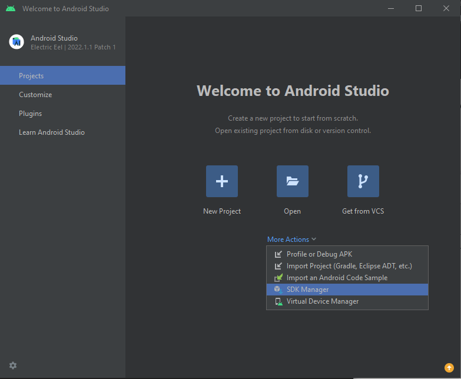
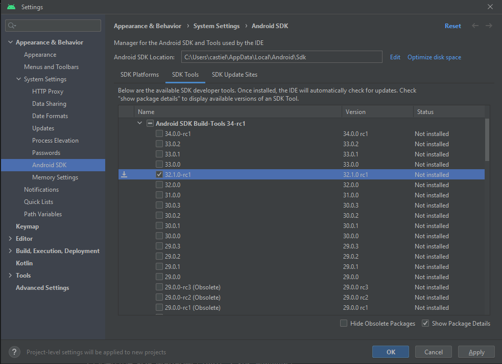
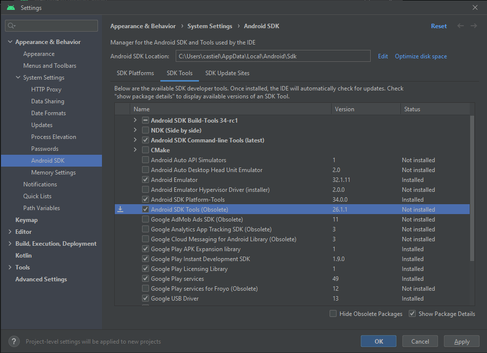

# Windows 10 version 2004 and up or 11 - release and development

A guide on how to set up a workspace and run a Cordova app on Android 12L on Windows 10 version 2004 and up or Windows
11. All commands will be ran in a standard Windows command prompt. There will be steps to follow at the end of this
guide to explain how to add a ``User Variable`` or a ``PATH`` correctly for your Windows installation.
I will refer to the ``System Variable`` named ``Path`` as ``PATH`` for simplicity and clarity.

## Installing Prerequisites for Cordova

Install the latest LTS version (**18.15.0**) of Node.JS for your system from the
following [link](https://nodejs.org/en/download/):

```none
https://nodejs.org/en/download/
```

During the installation, make sure to select ``Add to PATH``.


If you missed it, you can add it manually to your ``PATH`` by pointing to your ``...\nodejs`` directory.

Once installed correctly, run the following command:

```cmd
npm install -g cordova
```

## Setting up a project using a demo template

Once Cordova has been installed correctly using npm, move into your working directory and run the following command to
create a demo project:

```cmd
cordova create hello com.example.hello HelloWorld
```

A Cordova demo project should be created. Make sure a proper directory with the name "hello" has been created with all
its related files being created inside.

## Adding Android support

### Adding the Android platform

Travel inside your project's directory and run the following command to add Android 12L support to your project:

```cmd
cordova platform add android@11.0.0
```

Once done, you can verify it has been added successfully using the following command:

```cmd
cordova platform ls
```

## Installing requirements for Android

Once you have added your Android platform to the Cordova project with no problems. It is time to check if you comply
with all the requirements necessary to build and release an Android app. To see which requirements you are missing, run
the following command:

```cmd
cordova requirements
```

If you have a clean system, you will be missing all requirements, this guide will show you how to comply with each
individual prerequisite.

### Java SDK

Install the latest LTS version (**11.0.18**) of Java 11 for your system from the
following [link](https://www.oracle.com/java/technologies/downloads/#java11):

```none
https://www.oracle.com/java/technologies/downloads/#java11
```

Once it has been installed follow the next steps:

```none
1. Create a User Variable
2. Name it "JAVA_HOME"
3. Point it to your "...\jdk-11" folder
4. Add "...\javapath" to your System Variable "Path"
```

### Android SDK

Install the latest version (**2022.1.1 Patch 1**) of Android Studio Electric Eel for your system from the
following [link](https://developer.android.com/studio):

```none
https://developer.android.com/studio
```

Once Android Studio has been installed, we need to add the necessary SDK and tools to your Android Studio installation.

```none
1. Open Android Studio
2. Click on "More Actions"
3. Click on "SDK Manager"
```



Inside the  ``SDK Platforms`` tab, check ``Android 12L (Sv2)``.


Inside the ``SDK Tools`` tab, uncheck ``Hide Obsolete Packages`` at the bottom of the window. Check the following:

```none
1. Android SDK Command-line Tools
2. Android SDK Platform-tools
3. Android SDK Tools (Obsolete)
4. Android Emulator
5. Android SDK Build-Tools 32.1.0-rc1
```





Once you have completed the previous steps, you need to add to add and update your environment variables.

```none
1. Create a ``User Variable`` named ``ANDROID_SDK_ROOT`` with the path to your ``...\Sdk``
2. Point your ``PATH`` to ``...\Sdk\platform-tools``, ``\Sdk\cmdline-tools\latest\bin``
```

By default, theses folders should be in your ``C:\Users\[USERNAME]\AppData\Local\Android`` directory.

### Android Target

Once Android Studio has been installed, we need create a virtual device.

```none
1. Open Android Studio
2. Click on "More Actions"
3. Click on "Virtual Device Manager"
```


Once the window is open click on ``Create device`` and follow the steps from the wizard. When asked
to ``Select a system image`` make sure to select ``Sv2``.


Once you have completed the wizard, point your ``PATH`` to ``...\Sdk\tools\emulator``.

### Gradle

Download the latest version (**8.0.2**) of the Gradle Binaries for your system from the
following [link](https://gradle.org/releases/):

```none
https://gradle.org/releases/
```

Once it has been downloaded, extract them in a directory to your liking and create a ``PATH`` pointing to
your ``...\gradle-8.0\bin`` directory.

## Releasing an Android application

To build your project into an ``*.apk`` file, run the following command inside the root of your project:

```cmd
cordova build android
```

The application will be located at ``...\platforms\android\app\build\outputs\apk\debug\app-debug.apk``

To run your project directly, you can either turn on your newly created emulated device or connect a physical android
device running Android 12L or higher with ``USB Debugging`` enabled in ``developper settings``. Once you have set up
your chosen device, run the following command:

```cmd
cordova run android
```

## User Variables and PATH

### Opening the Environment Variables window

```none
1. Open the "Control Panel" from the start menu
2. Select "System" under the "System and Security" tab
3. Click on "Advanced system settings"
4. Click on "Environment Variables..."
```

### Creating a User Variable

For this section, we will only work under the ``user variables for [USERNAME]`` section

```none
1. Click on "New..."
2. Fill both fields with the desired values
3. Press "OK"
```

Repeat the previous steps for every variable you wish to add.

### Adding to your Path variable

For this section, we will only work under the ``system variables`` section

```none
1. In the list of variables, select "Path"
2. Click on "Edit..."
3. Inside the new window, click on "New" 
4. Within the new empty field, specify the desired directy to point at
5. Press "OK"
```

Repeat the previous steps for every variable you wish to add.

### Saving modifications to your Environment Variables

Once you have done all your changes, make sure to close your ``Environment Variables`` window using the ``OK`` button.

### Troubleshooting Environment Variables

Make sure to relaunch any command prompt windows you have open to make sure they are reinitialized with the new values
you have just created and/or edited.