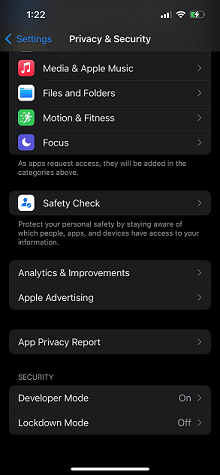
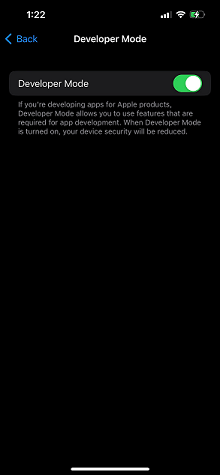
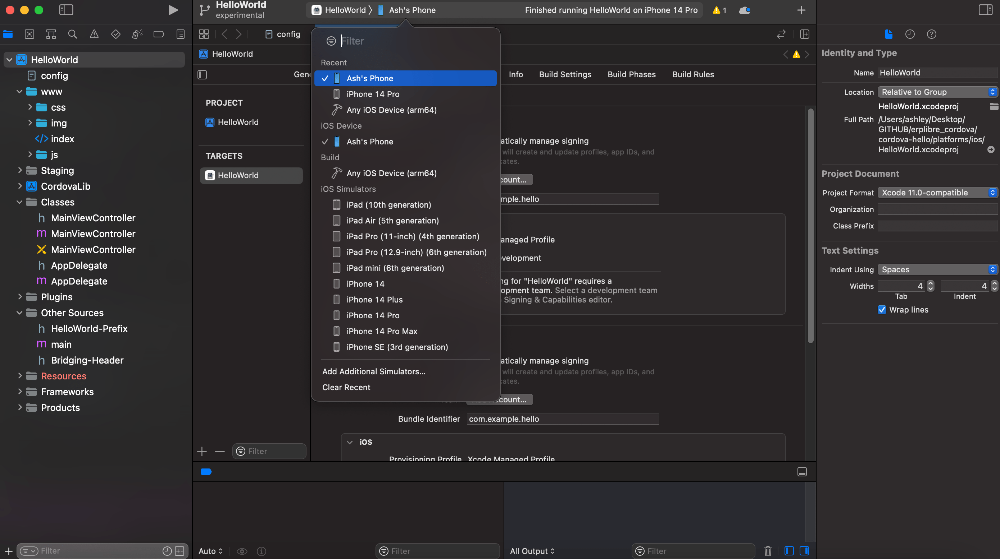

# OS X version 10.14.4 and up - release and development

A guide on how to set up a workspace and run a Cordova app on OS X version 10.14.4 and up. You will need an Intel based
system. All commands will be ran in a standard terminal.

## Installing Prerequisites for Cordova

Install Node.JS and npm for your system with the following commands:

```bash
brew install node
brew install npm
```

You can verify that Node.JS and npm were installed successfully by running the following commands:

```bash
node -v
npm -v
```

Once both are installed correctly, run the following command:

```bash
npm install -g cordova
```

## Setting up a project using a demo template

Once Cordova has been installed correctly using npm, move into your working directory and run the following command to
create a demo project:

```bash
cordova create hello com.example.hello HelloWorld
```

A Cordova demo project should be created. Make sure a proper directory with the name "hello" has been created with all
its related files being created inside.

## Adding IOS support

### Adding the Android platform

Travel inside your project's directory and run the following commands to add Android 12L support to your project:

```bash
cd hello
cordova platform add ios
```

Once done, you can verify it has been added successfully using the following command:

```bash
cordova platform ls
```

## Installing requirements for IOS

Once you have added your IOS platform to the Cordova project with no problems. It is time to check if you comply with
all the requirements necessary to build and release an Android app. To see which requirements you are missing, run the
following command:

```bash
cordova requirements
```

If you have a clean system, you will be missing all requirements, this guide will show you how to comply with each
individual prerequisite.

### Xcode

If you don't have an Apple Developer account, install the latest version of Xcode for macOS from the
following [link](https://apps.apple.com/us/app/xcode/id497799835):

```none
https://apps.apple.com/us/app/xcode/id497799835
```

If you have an Apple Developer account, install the latest version of Xcode for macOS from the
following [link](https://developer.apple.com/downloads/index.action):

```none
https://developer.apple.com/downloads/index.action
```

Once Xcode is installed, run the following commands:

```bash
xcode-select --install
brew install ios-deploy
sudo gem install activesupport -v 6.1.7.3
sudo gem install cocoapods
```

## Releasing an IOS application

### Building

To build your project into a packaged *.ipa file, run the following command inside the root of your project:

```bash
cordova build ios
```

### Running in an Emulator

To run your project in an emulator, run one of the two following command:

```bash
cordova run ios
cordova emulate
```

### Running on a Physical Device

To run your project on a physical device you will need a licenced Apple Developper Account and follow the next steps
carefully:

1. Connect your device to your computer with a compliant lightning cable.
2. Enable Developper Mode on your chosen device.




3. Open the *.xcworkspace project file with the following command:

```bash
open ./platforms/ios/HelloWorld.xcworkspace/
```

4. At the top, select a device to transfer your app to.



5. Press the Play button.
6. The app will now be pushed to your device.