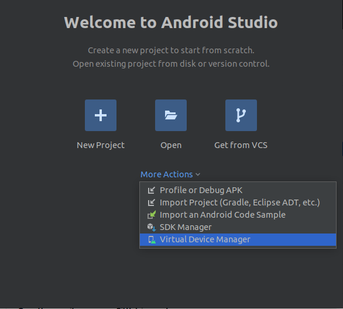
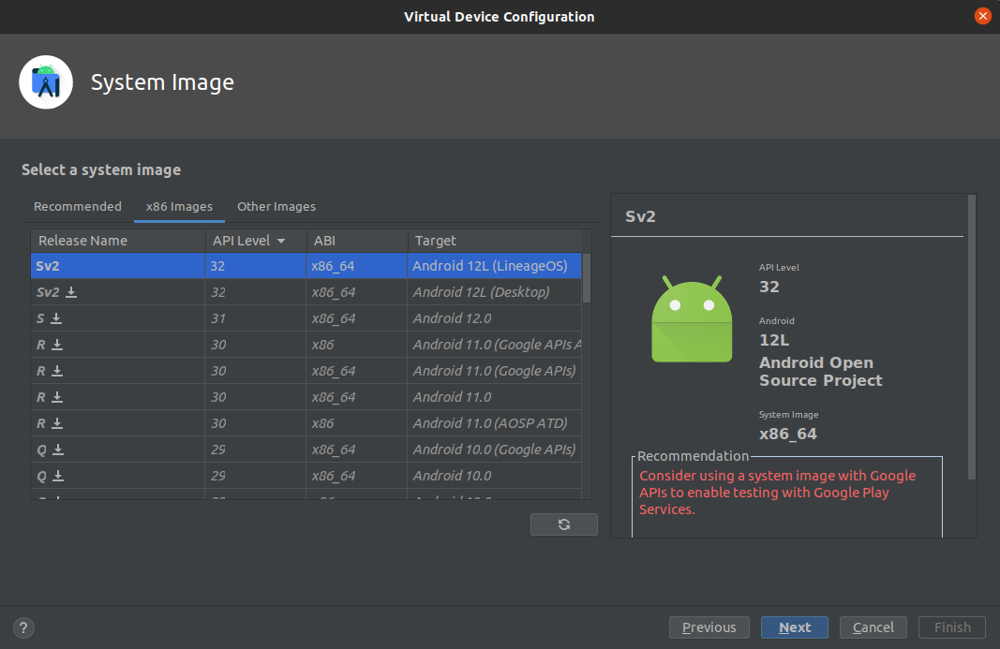

# Ubuntu 20.04 LTS and up - release and development

A guide on how to set up a workspace, build and run your own build of LineageOS 19.1 on Ubuntu 20.04 LTS and up. All
commands will be ran in the standard Ubuntu terminal. You will need around 350 GB of free space in your `home`
directory.

# Installing Prerequisites for LineageOS 19.1

## platform-tools

Install Google's platform-tools from the
following [link](https://dl.google.com/android/repository/platform-tools-latest-linux.zip)

```bash
https://dl.google.com/android/repository/platform-tools-latest-linux.zip
```

Extract the contents of the archive with the following command:

```bash
unzip platform-tools-latest-linux.zip -d ~
```

Once the contents have been extracted, add the following lines to your `~/.profile` file:

```bash
# add Android SDK platform tools to path
if [ -d "$HOME/platform-tools" ] ; then
    PATH="$HOME/platform-tools:$PATH"
fi
```

Run the following command to update your environment:

```bash
source ~/.profile
```

## build packages

Using your package manager of choice, install all of the following packages.

```bash
bc bison build-essential ccache curl flex g++-multilib gcc-multilib git git-lfs gnupg gperf imagemagick lib32ncurses5-dev lib32readline-dev lib32z1-dev libelf-dev liblz4-tool libncurses5 libncurses5-dev libsdl1.2-dev libssl-dev libxml2 libxml2-utils lzop pngcrush rsync schedtool squashfs-tools xsltproc zip zlib1g-dev
```

## python3

It is necessary that `python3` is your system's primary python distribution. You can check if it is by running the
following command:

```bash
python --version
```

If the displayed version of your system's current default python is not `python3`, run the following command to fix it:

```bash
sudo update-alternatives --install /usr/bin/python python /usr/bin/python3 10
```

# Building LineageOS 19.1

## work environment

Once all the prerequisites have been succesfully installed, create the following directories with their respective
commands:

```bash
mkdir -p ~/bin
mkdir -p ~/android/lineage
```

Download the `repo` binary and configure it with the following commands:

```bash
curl https://storage.googleapis.com/git-repo-downloads/repo > ~/bin/repo
chmod a+x ~/bin/repo
```

## git

Verify that you have configured your `git` identity with the following commands:

```bash
git config user.name
git config user.email
```

If they haven't been configured, configure them with the following commands:

```bash
git config --global user.email "you@example.com"
git config --global user.name "Your Name"
```

## ccache - Optional

Add the following lines to your `~/.bashrc` file:

```bash
export USE_CCACHE=1
export CCACHE_EXEC=/usr/bin/ccache
```

Run the following command to update your environment:

```bash
source ~/.bashrc
```

Run the following commands to specify the size of your cache and to enable compression for it:

```bash
ccache -M 50G
ccache -o compression=true
```

## repo

Run the following commands to initiliaze and sync the LineageOS source repository:

```bash
cd ~/android/lineage
repo init -u https://github.com/LineageOS/android.git -b lineage-19.1 --git-lfs
repo sync
```

## build

Once the repository has been fully synced, run the following commands to build a ROM from the sources by yourself:

```bash
source build/envsetup.sh
lunch lineage_sdk_phone_x86_64-eng
mka
```

# Running LineageOS 19.1

## Terminal

If you want to run your new build of LineageOS 19.1 from your terminal, execute the following command:

```bash
emulator
```

## Android Studio - Optional

If you want to run your new build of LineageOS 19.1 from Android Studio's AVD Manager, make sure to have Android Studio
installed and execute the following commands:

```bash
mka sdk_addon
```

Add LineageOS 19.1 to the list of available images with the following steps:

```none
1. Create the a folder "lineageOS-19.1" in ~/Android/Sdk/system-images
2. Go to ~/android/lineage/out/host/linux-x86/sdk_addon
3. Find the corresponding .zip ending with -img.zip
4. Extract it's content into ~/Android/Sdk/system-images/lineageOS-19.1
```

We can now create a virtual device with LineageOS 19.1 by opening Android Studio and the following next steps:

```none
1. Open Android Studio
2. Click on "More Actions"
3. Click on "Virtual Device Manager"
```



Once the window is open click on `Create device` and follow the steps from the wizard. When asked
to `Select a system image`, make sure to select `x86 Images` tab. Inside the new list, look for an entry with the target
of `Android 12L (LineageOS)`



Once the device has been created, it can be ran with no issues.

# Developping LineageOS 19.1

Here is a [reference](https://wiki.lineageos.org/how-to/import-to-android-studio) explaining how to import the sources
correctly into an IDE (Android Studio). I have not been able to do so succesfully.
